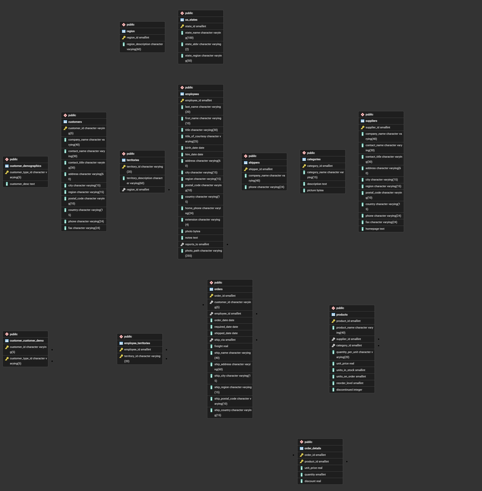

# Práctica 02 - Northwind SQL

**Alumno:** Rubén García Hernández
**Entorno:** PostgreSQL 18 / pgAdmin 4

## Instalación y preparación
1. Crear la base de datos `northwind` especificando la codificación UTF-8 para evitar problemas de caracteres:
   ```sql
   CREATE DATABASE northwind WITH ENCODING = 'UTF8' TEMPLATE = template0;
   ```
2. Conectarse a la base de datos `northwind` asegurando que esté seleccionada.
3. Ejecutar el script `northwind.sql` proporcionado en el material de la asignatura en el Query Tool de pgAdmin.

## Diagrama Entidad-Relación


## Consultas de análisis
Las soluciones a las consultas de análisis están documentadas en:
[Ver respuestas a los ejercicios](respuestas.md)
