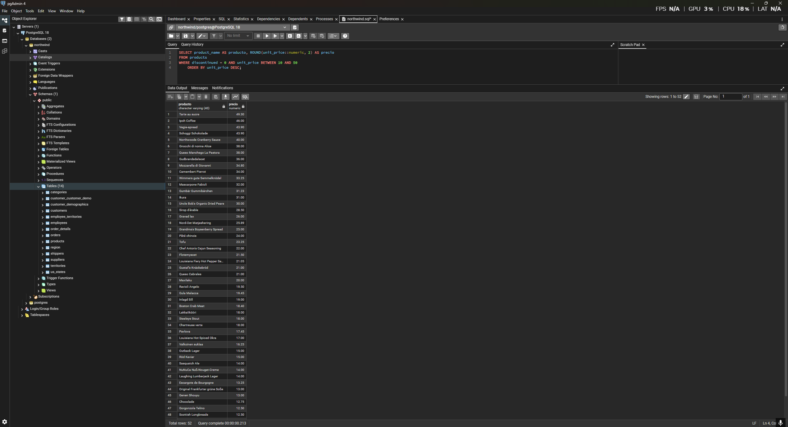
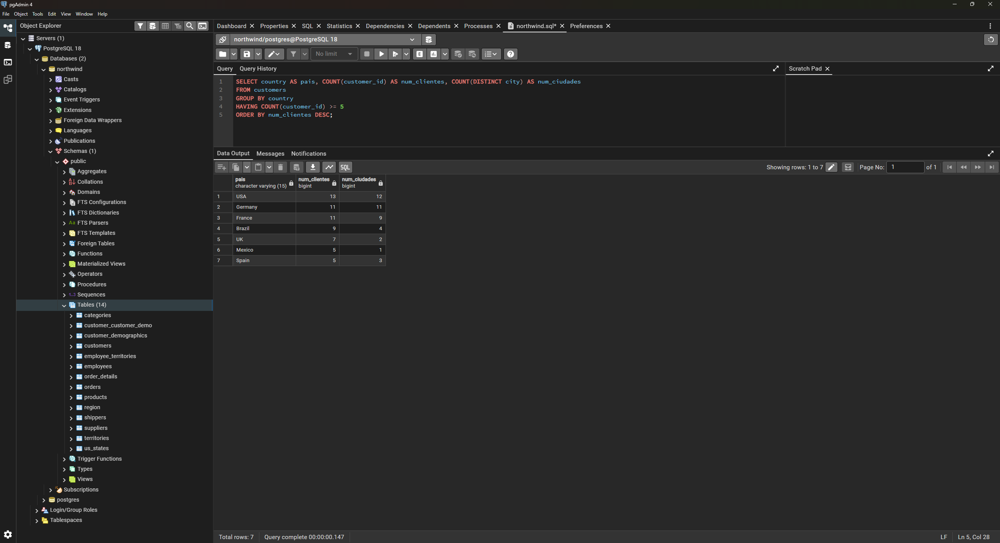
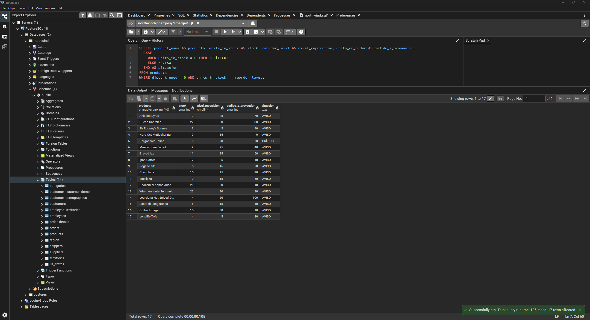
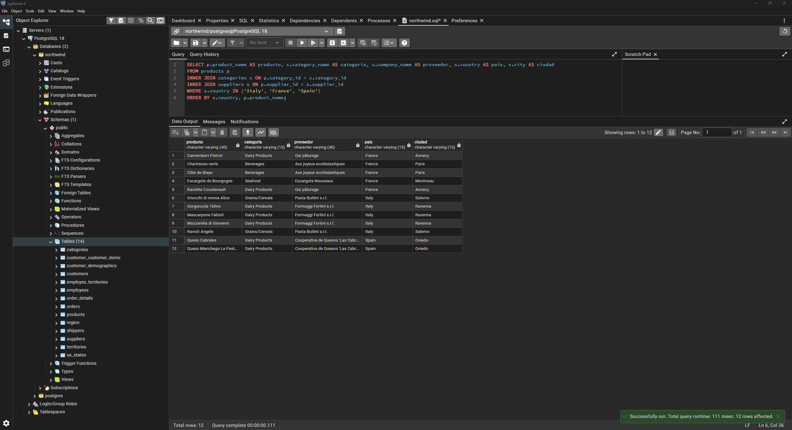
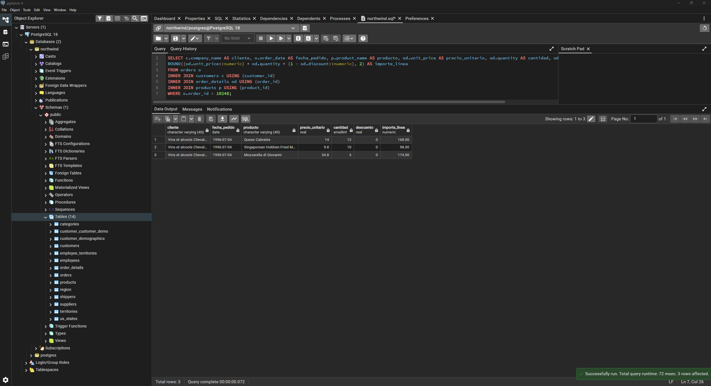
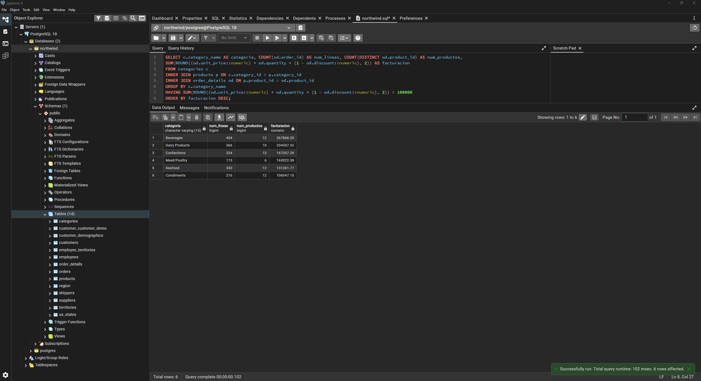

# Respuestas a los ejercicios prácticos

## Pregunta 1 — Catálogo comercial activo
**Enunciado:** Obtén los productos que no están descatalogados y cuyo precio unitario esté entre 10 y 50 euros, ambos incluidos. Muestra el nombre del producto y su precio redondeado a dos decimales, ordenado de mayor a menor precio.

**Consulta:**
```sql
SELECT product_name AS producto, ROUND(unit_price::numeric, 2) AS precio
FROM products
WHERE discontinued = 0 AND unit_price BETWEEN 10 AND 50
ORDER BY unit_price DESC;
```

**Resultado:**


**Comentario:** He filtrado usando `discontinued = 0` y `BETWEEN` para el rango de precios. El casteo a `numeric` dentro del `ROUND` asegura precisión decimal.

---

## Pregunta 2 — Concentración geográfica de la cartera
**Enunciado:** Cuenta cuántos clientes hay en cada país y muestra únicamente aquellos países con 5 o más clientes, ordenados de mayor a menor. Indica también cuántas ciudades distintas hay en cada uno de esos países.

**Consulta:**
```sql
SELECT country AS pais, COUNT(customer_id) AS num_clientes, COUNT(DISTINCT city) AS num_ciudades
FROM customers
GROUP BY country
HAVING COUNT(customer_id) >= 5
ORDER BY num_clientes DESC;
```

**Resultado:**


**Comentario:** Uso `HAVING` porque el filtro de >= 5 clientes se aplica al resultado de la agregación `COUNT(customer_id)`, por lo que no es posible hacerlo en el `WHERE`.

---

## Pregunta 3 — Alerta de reposición
**Enunciado:** Localiza los productos activos cuyas unidades en stock sean inferiores o iguales a su nivel de reposición. Muestra el nombre, las unidades en stock, el nivel de reposición, las unidades ya pedidas al proveedor y una columna de texto que indique 'CRÍTICO' cuando el stock sea 0 y 'AVISO' en el resto de casos.

**Consulta:**
```sql
SELECT product_name AS producto, units_in_stock AS stock, reorder_level AS nivel_reposicion, units_on_order AS pedido_a_proveedor,
  CASE 
    WHEN units_in_stock = 0 THEN 'CRÍTICO'
    ELSE 'AVISO'
  END AS situacion
FROM products
WHERE discontinued = 0 AND units_in_stock <= reorder_level;
```

**Resultado:**


**Comentario:** Para crear la columna personalizada uso la sentencia condicional `CASE WHEN`. El filtro de stock menor o igual al nivel de reposición se hace fácilmente en el `WHERE`.

---

## Pregunta 4 — Ficha completa de producto
**Enunciado:** Para los productos suministrados por empresas de Italia, Francia o España, muestra el nombre del producto, el nombre de la categoría, el nombre del proveedor, su país y su ciudad. Ordena por país y, dentro de cada país, por nombre de producto.

**Consulta:**
```sql
SELECT p.product_name AS producto, c.category_name AS categoria, s.company_name AS proveedor, s.country AS pais, s.city AS ciudad
FROM products p
INNER JOIN categories c ON p.category_id = c.category_id
INNER JOIN suppliers s ON p.supplier_id = s.supplier_id
WHERE s.country IN ('Italy', 'France', 'Spain')
ORDER BY s.country, p.product_name;
```

**Resultado:**


**Comentario:** Hago `INNER JOIN` de las tablas `products`, `categories` y `suppliers` para obtener la información solicitada. Uso `IN` para filtrar por los 3 países deseados.

---

## Pregunta 5 — Detalle valorizado de un pedido
**Enunciado:** Muestra, para ese pedido (10248), el nombre del producto, el precio unitario aplicado, la cantidad, el descuento y el importe final de cada línea. Añade el nombre del cliente y la fecha del pedido.

**Consulta:**
```sql
SELECT c.company_name AS cliente, o.order_date AS fecha_pedido, p.product_name AS producto, od.unit_price AS precio_unitario, od.quantity AS cantidad, od.discount AS descuento,
ROUND((od.unit_price::numeric) * od.quantity * (1 - od.discount::numeric), 2) AS importe_linea
FROM orders o
INNER JOIN customers c USING (customer_id)
INNER JOIN order_details od USING (order_id)
INNER JOIN products p USING (product_id)
WHERE o.order_id = 10248;
```

**Resultado:**


**Comentario:** Utilizo la cláusula `USING` porque las columnas a unir comparten exactamente el mismo nombre (`customer_id`, `order_id`, `product_id`), lo que simplifica la sintaxis de las cuatro uniones.

---

## Pregunta 6 — Ranking de categorías por facturación
**Enunciado:** Calcula la facturación total de cada categoría durante toda la historia de la compañía. Muestra el nombre de la categoría, el número de líneas de pedido que ha generado, el número de productos distintos vendidos y la facturación total. Incluye únicamente las categorías que superen los 100.000 euros de facturación, ordenadas de mayor a menor.

**Consulta:**
```sql
SELECT c.category_name AS categoria, COUNT(od.order_id) AS num_lineas, COUNT(DISTINCT od.product_id) AS num_productos,
SUM(ROUND((od.unit_price::numeric) * od.quantity * (1 - od.discount::numeric), 2)) AS facturacion
FROM categories c
INNER JOIN products p ON c.category_id = p.category_id
INNER JOIN order_details od ON p.product_id = od.product_id
GROUP BY c.category_name
HAVING SUM(ROUND((od.unit_price::numeric) * od.quantity * (1 - od.discount::numeric), 2)) > 100000
ORDER BY facturacion DESC;
```

**Resultado:**


**Comentario:** Hago la agregación con `GROUP BY` por categoría, usando `COUNT(DISTINCT ...)` para los productos únicos vendidos. El filtro de más de 100.000 euros debe ir en el `HAVING` al depender de la sumatoria agregada.

