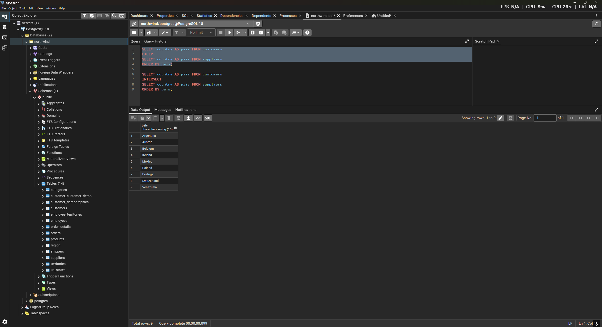
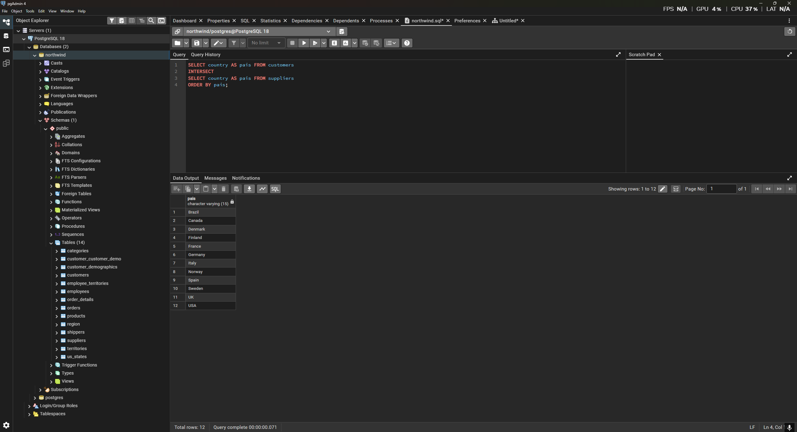
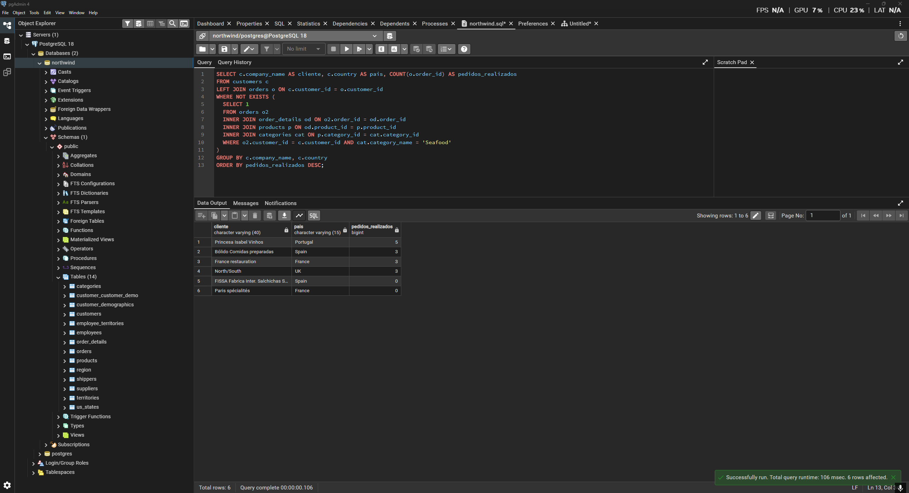
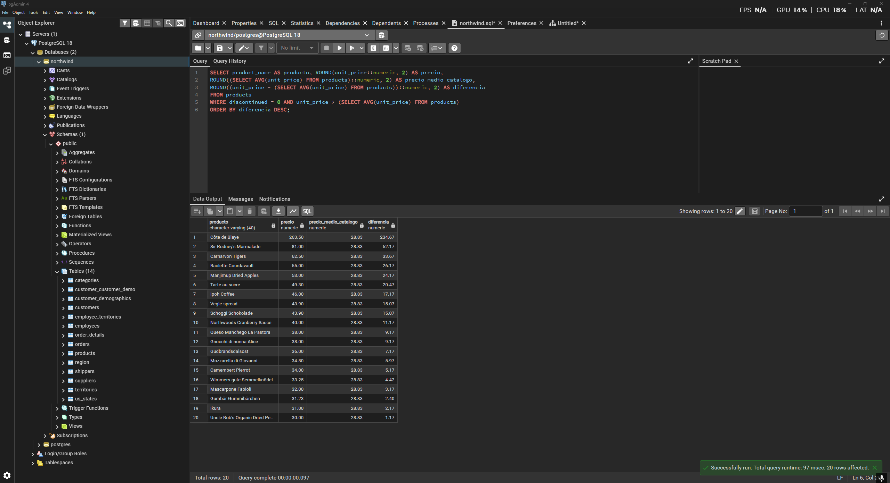
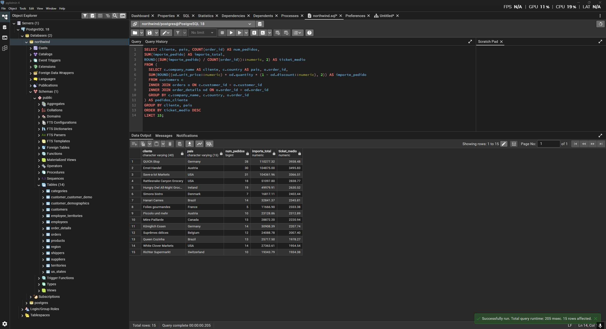
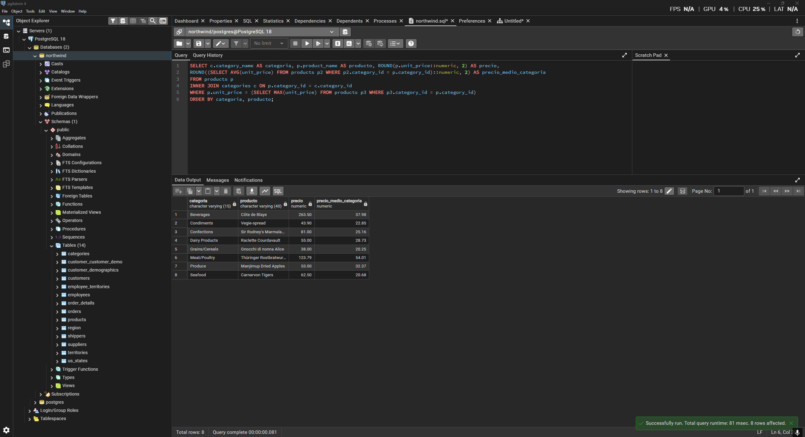

# Respuestas a los ejercicios prácticos

## Pregunta 1 — Catálogo comercial activo
**Enunciado:** Obtén los productos que no están descatalogados y cuyo precio unitario esté entre 10 y 50 euros, ambos incluidos. Muestra el nombre del producto y su precio redondeado a dos decimales, ordenado de mayor a menor precio.

**Consulta:**
```sql
-- Obtiene el nombre y precio redondeado de los productos activos con precio entre 10 y 50
SELECT product_name AS producto, ROUND(unit_price::numeric, 2) AS precio
FROM products
WHERE discontinued = 0 AND unit_price BETWEEN 10 AND 50
ORDER BY unit_price DESC;
```

**Resultado:**


**Comentario:** Uso `discontinued = 0` y `BETWEEN` para filtrar. El cast a `numeric` dentro de `ROUND` evita errores de redondeo.

---

## Pregunta 2 — Concentración geográfica de la cartera
**Enunciado:** Cuenta cuántos clientes hay en cada país y muestra únicamente aquellos países con 5 o más clientes, ordenados de mayor a menor. Indica también cuántas ciudades distintas hay en cada uno de esos países.

**Consulta:**
```sql
-- Cuenta clientes y ciudades distintas por país, mostrando solo los países con 5 o más clientes
SELECT country AS pais, COUNT(customer_id) AS num_clientes, COUNT(DISTINCT city) AS num_ciudades
FROM customers
GROUP BY country
HAVING COUNT(customer_id) >= 5
ORDER BY num_clientes DESC;
```

**Resultado:**


**Comentario:** `HAVING` permite filtrar por el conteo `COUNT(customer_id) >= 5` después de agrupar por país.

---

## Pregunta 3 — Alerta de reposición
**Enunciado:** Localiza los productos activos cuyas unidades en stock sean inferiores o iguales a su nivel de reposición. Muestra el nombre, las unidades en stock, el nivel de reposición, las unidades ya pedidas al proveedor y una columna de texto que indique 'CRÍTICO' cuando el stock sea 0 y 'AVISO' en el resto de casos.

**Consulta:**
```sql
-- Detecta productos activos con stock crítico o bajo aviso respecto a su nivel de reposición
SELECT product_name AS producto, units_in_stock AS stock, reorder_level AS nivel_reposicion, units_on_order AS pedido_a_proveedor,
  CASE 
    WHEN units_in_stock = 0 THEN 'CRÍTICO'
    ELSE 'AVISO'
  END AS situacion
FROM products
WHERE discontinued = 0 AND units_in_stock <= reorder_level;
```

**Resultado:**


**Comentario:** Uso `CASE WHEN` para crear la columna condicional y `WHERE` para el filtro de stock.

---

## Pregunta 4 — Ficha completa de producto
**Enunciado:** Para los productos suministrados por empresas de Italia, Francia o España, muestra el nombre del producto, el nombre de la categoría, el nombre del proveedor, su país y su ciudad. Ordena por país y, dentro de cada país, por nombre de producto.

**Consulta:**
```sql
-- Lista productos, categorías y datos del proveedor para los suministrados desde Italia, Francia o España
SELECT p.product_name AS producto, c.category_name AS categoria, s.company_name AS proveedor, s.country AS pais, s.city AS ciudad
FROM products p
INNER JOIN categories c ON p.category_id = c.category_id
INNER JOIN suppliers s ON p.supplier_id = s.supplier_id
WHERE s.country IN ('Italy', 'France', 'Spain')
ORDER BY s.country, p.product_name;
```

**Resultado:**


**Comentario:** Hago `INNER JOIN` entre las tres tablas relacionadas y `IN` para filtrar los tres países europeos.

---

## Pregunta 5 — Detalle valorizado de un pedido
**Enunciado:** Muestra, para ese pedido (10248), el nombre del producto, el precio unitario aplicado, la cantidad, el descuento y el importe final de cada línea. Añade el nombre del cliente y la fecha del pedido.

**Consulta:**
```sql
-- Detalle completo valorizado de las líneas del pedido 10248
SELECT c.company_name AS cliente, o.order_date AS fecha_pedido, p.product_name AS producto, od.unit_price AS precio_unitario, od.quantity AS cantidad, od.discount AS descuento,
ROUND((od.unit_price::numeric) * od.quantity * (1 - od.discount::numeric), 2) AS importe_linea
FROM orders o
INNER JOIN customers c USING (customer_id)
INNER JOIN order_details od USING (order_id)
INNER JOIN products p USING (product_id)
WHERE o.order_id = 10248;
```

**Resultado:**


**Comentario:** Utilizo `USING` para simplificar los `INNER JOIN`, ya que las claves foráneas tienen el mismo nombre en ambas tablas.

---

## Pregunta 6 — Ranking de categorías por facturación
**Enunciado:** Calcula la facturación total de cada categoría durante toda la historia de la compañía. Muestra el nombre de la categoría, el número de líneas de pedido que ha generado, el número de productos distintos vendidos y la facturación total. Incluye únicamente las categorías que superen los 100.000 euros de facturación, ordenadas de mayor a menor.

**Consulta:**
```sql
-- Muestra las categorías que superan los 100.000 de facturación total, con número de líneas y productos distintos
SELECT c.category_name AS categoria, COUNT(od.order_id) AS num_lineas, COUNT(DISTINCT od.product_id) AS num_productos,
SUM(ROUND((od.unit_price::numeric) * od.quantity * (1 - od.discount::numeric), 2)) AS facturacion
FROM categories c
INNER JOIN products p ON c.category_id = p.category_id
INNER JOIN order_details od ON p.product_id = od.product_id
GROUP BY c.category_name
HAVING SUM(ROUND((od.unit_price::numeric) * od.quantity * (1 - od.discount::numeric), 2)) > 100000
ORDER BY facturacion DESC;
```

**Resultado:**


**Comentario:** Uso `COUNT(DISTINCT ...)` para productos únicos y `HAVING` para filtrar la suma total agregada.

---

## Pregunta 7 — Clientes sin actividad comercial
**Enunciado:** Lista todos los clientes con el número de pedidos que ha realizado cada uno y la fecha de su último pedido. Los clientes sin ningún pedido deben aparecer igualmente, con un 0 en el conteo y el texto 'SIN PEDIDOS' en lugar de la fecha. Ordena de forma que los clientes inactivos aparezcan primero.

**Consulta:**
```sql
-- Lista clientes con su cantidad de pedidos y la fecha del último pedido, incluyendo inactivos
SELECT c.company_name AS cliente, c.country AS pais, COUNT(o.order_id) AS num_pedidos,
COALESCE(MAX(o.order_date)::text, 'SIN PEDIDOS') AS ultimo_pedido
FROM customers c
LEFT JOIN orders o ON c.customer_id = o.customer_id
GROUP BY c.company_name, c.country
ORDER BY num_pedidos ASC, c.company_name ASC;
```

**Resultado:**


**Comentario:** Un `LEFT JOIN` junto con `COUNT(columna)` asegura que los clientes inactivos sumen 0. Uso `COALESCE` para dar formato al valor nulo.

---

## Pregunta 8 — Organigrama de la fuerza de ventas
**Enunciado:** Muestra cada empleado con su nombre completo, su cargo, el nombre completo de la persona a la que reporta y el cargo de esa persona. El empleado que no reporta a nadie debe aparecer también, con el texto 'DIRECCIÓN GENERAL' en el campo del responsable.

**Consulta:**
```sql
-- Organigrama de empleados mostrando a quién reportan
SELECT e1.first_name || ' ' || e1.last_name AS empleado, e1.title AS cargo,
COALESCE(e2.first_name || ' ' || e2.last_name, 'DIRECCIÓN GENERAL') AS responsable,
e2.title AS cargo_responsable
FROM employees e1
LEFT JOIN employees e2 ON e1.reports_to = e2.employee_id;
```

**Resultado:**


**Comentario:** El `SELF JOIN` con alias `e1` y `e2` es obligatorio para relacionar la tabla consigo misma.

---

## Pregunta 9 — Rejilla de cobertura categoría × año
**Enunciado:** Genera todas las combinaciones posibles de las 8 categorías con los 3 años del histórico (24 filas) y asocia a cada combinación su facturación. Ordena por categoría y año.

**Consulta:**
```sql
-- Rejilla completa de facturación cruzando todas las categorías con todos los años disponibles
WITH anios AS (
  SELECT DISTINCT EXTRACT(YEAR FROM order_date) AS anio FROM orders
),
rejilla AS (
  SELECT c.category_id, c.category_name AS categoria, a.anio
  FROM categories c
  CROSS JOIN anios a
)
SELECT r.categoria, r.anio,
COALESCE(SUM(ROUND((od.unit_price::numeric) * od.quantity * (1 - od.discount::numeric), 2)), 0) AS facturacion
FROM rejilla r
LEFT JOIN products p ON r.category_id = p.category_id
LEFT JOIN order_details od ON p.product_id = od.product_id
LEFT JOIN orders o ON od.order_id = o.order_id AND EXTRACT(YEAR FROM o.order_date) = r.anio
GROUP BY r.categoria, r.anio
ORDER BY r.categoria, r.anio;
```

**Resultado:**


**Comentario:** Construyo las combinaciones totales con un `CROSS JOIN` en una CTE y luego uno los datos con `LEFT JOIN`.

---

## Pregunta 10 — Mapa de países: clientes frente a proveedores
**Enunciado:** Una única tabla que muestre, para cada país en el que la compañía tiene presencia, cuántos clientes y cuántos proveedores hay. Deben aparecer los países que solo tienen clientes, los que solo tienen proveedores y los que tienen ambos.

**Consulta:**
```sql
-- Mapa de países mostrando cantidad de clientes y proveedores en cada uno
WITH paises_clientes AS (
  SELECT country AS pais, COUNT(customer_id) AS num_clientes
  FROM customers
  GROUP BY country
),
paises_proveedores AS (
  SELECT country AS pais, COUNT(supplier_id) AS num_proveedores
  FROM suppliers
  GROUP BY country
)
SELECT COALESCE(c.pais, p.pais) AS pais,
COALESCE(c.num_clientes, 0) AS num_clientes,
COALESCE(p.num_proveedores, 0) AS num_proveedores,
CASE
  WHEN c.num_clientes IS NULL THEN 'SOLO PROVEEDORES'
  WHEN p.num_proveedores IS NULL THEN 'SOLO CLIENTES'
  ELSE 'AMBOS'
END AS tipo_presencia
FROM paises_clientes c
FULL JOIN paises_proveedores p ON c.pais = p.pais
ORDER BY pais;
```

**Resultado:**


**Comentario:** Calculo clientes y proveedores en CTEs separadas y las uno mediante `FULL JOIN` conservando todos los países.

---

## Pregunta 11 — Directorio unificado de contactos
**Enunciado:** Construye una sola tabla que reúna los contactos de clientes, los de proveedores y los empleados. Cada fila debe indicar el origen ('CLIENTE', 'PROVEEDOR', 'EMPLEADO'), el nombre de la persona de contacto en mayúsculas, la organización a la que pertenece, la ciudad y el país. Para los empleados, la organización es el literal 'NORTHWIND TRADERS' y el nombre de contacto se forma concatenando nombre y apellidos.

**Consulta:**
```sql
-- Directorio unificado de todos los contactos (clientes, proveedores y empleados)
SELECT 'CLIENTE' AS origen, UPPER(contact_name) AS contacto, company_name AS organizacion, city AS ciudad, country AS pais
FROM customers
UNION ALL
SELECT 'PROVEEDOR' AS origen, UPPER(contact_name) AS contacto, company_name AS organizacion, city AS ciudad, country AS pais
FROM suppliers
UNION ALL
SELECT 'EMPLEADO' AS origen, UPPER(first_name || ' ' || last_name) AS contacto, 'NORTHWIND TRADERS' AS organizacion, city AS ciudad, country AS pais
FROM employees
ORDER BY origen, pais;
```

**Resultado:**


**Comentario:** `UNION ALL` combina los contactos manteniendo el mismo número y orden de columnas.

---

## Pregunta 12 — Mercados con desequilibrio
**Enunciado:** Resuelve las dos preguntas en dos consultas independientes:
a) Países donde hay clientes pero ningún proveedor.
b) Países donde hay a la vez clientes y proveedores.
Ordena ambos resultados alfabéticamente.

**Consulta a):**
```sql
-- a) Países con clientes pero sin proveedores
SELECT country AS pais FROM customers
EXCEPT
SELECT country AS pais FROM suppliers
ORDER BY pais;
```

**Resultado a):**


**Consulta b):**
```sql
-- b) Países con clientes y proveedores a la vez
SELECT country AS pais FROM customers
INTERSECT
SELECT country AS pais FROM suppliers
ORDER BY pais;
```

**Resultado b):**


**Comentario:** `EXCEPT` retiene la diferencia de conjuntos e `INTERSECT` la intersección. Ambos eliminan duplicados automáticamente.

---

## Pregunta 13 — Clientes que nunca han comprado pescado
**Enunciado:** Localiza los clientes que nunca han incluido un producto de la categoría 'Seafood' en ninguno de sus pedidos. Muestra el nombre del cliente, su país y el número total de pedidos que sí ha realizado, de mayor a menor.

**Consulta:**
```sql
-- Clientes sin compras en la categoría Seafood y total de sus pedidos
SELECT c.company_name AS cliente, c.country AS pais, COUNT(o.order_id) AS pedidos_realizados
FROM customers c
LEFT JOIN orders o ON c.customer_id = o.customer_id
WHERE NOT EXISTS (
  SELECT 1
  FROM orders o2
  INNER JOIN order_details od ON o2.order_id = od.order_id
  INNER JOIN products p ON od.product_id = p.product_id
  INNER JOIN categories cat ON p.category_id = cat.category_id
  WHERE o2.customer_id = c.customer_id AND cat.category_name = 'Seafood'
)
GROUP BY c.company_name, c.country
ORDER BY pedidos_realizados DESC;
```

**Resultado:**


**Comentario:** El anti-join con `NOT EXISTS` evita problemas con valores nulos, apoyándose en una subconsulta correlacionada.

---

## Pregunta 14 — Productos por encima de la media
**Enunciado:** Muestra los productos activos cuyo precio unitario supere el precio medio de todo el catálogo. Incluye en cada fila el precio del producto, el precio medio general y la diferencia entre ambos, todo redondeado a dos decimales. Ordena por diferencia descendente.

**Consulta:**
```sql
-- Productos activos con precio superior a la media del catálogo
SELECT product_name AS producto, ROUND(unit_price::numeric, 2) AS precio,
ROUND((SELECT AVG(unit_price) FROM products)::numeric, 2) AS precio_medio_catalogo,
ROUND((unit_price - (SELECT AVG(unit_price) FROM products))::numeric, 2) AS diferencia
FROM products
WHERE discontinued = 0 AND unit_price > (SELECT AVG(unit_price) FROM products)
ORDER BY diferencia DESC;
```

**Resultado:**


**Comentario:** Una subconsulta escalar en el `SELECT` y en el `WHERE` permite reutilizar la media global del catálogo.

---

## Pregunta 15 — Ticket medio por cliente
**Enunciado:** Calcula, para cada cliente que haya comprado alguna vez, el número de pedidos, el importe total acumulado y el importe medio por pedido. Muestra los 15 clientes con mayor ticket medio.

**Consulta:**
```sql
-- Top 15 clientes con mayor ticket medio por pedido
SELECT cliente, pais, COUNT(order_id) AS num_pedidos,
SUM(importe_pedido) AS importe_total,
ROUND((SUM(importe_pedido) / COUNT(order_id))::numeric, 2) AS ticket_medio
FROM (
  SELECT c.company_name AS cliente, c.country AS pais, o.order_id,
  SUM(ROUND((od.unit_price::numeric) * od.quantity * (1 - od.discount::numeric), 2)) AS importe_pedido
  FROM customers c
  INNER JOIN orders o ON c.customer_id = o.customer_id
  INNER JOIN order_details od ON o.order_id = od.order_id
  GROUP BY c.company_name, c.country, o.order_id
) AS pedidos_cliente
GROUP BY cliente, pais
ORDER BY ticket_medio DESC
LIMIT 15;
```

**Resultado:**


**Comentario:** Agrupo primero por pedido en una tabla derivada y luego por cliente para obtener promedios correctos por encima del importe.

---

## Pregunta 16 — El producto más caro de cada categoría
**Enunciado:** Para cada categoría, muestra el producto con el precio unitario más alto. Incluye el nombre de la categoría, el nombre del producto, su precio y el precio medio de su categoría. Resuélvelo con una subconsulta correlacionada: para cada producto, comprueba si su precio coincide con el máximo de su propia categoría.

**Consulta:**
```sql
-- El producto más caro de cada categoría comparado con el precio medio de la misma
SELECT c.category_name AS categoria, p.product_name AS producto, ROUND(p.unit_price::numeric, 2) AS precio,
ROUND((SELECT AVG(unit_price) FROM products p2 WHERE p2.category_id = p.category_id)::numeric, 2) AS precio_medio_categoria
FROM products p
INNER JOIN categories c ON p.category_id = c.category_id
WHERE p.unit_price = (SELECT MAX(unit_price) FROM products p3 WHERE p3.category_id = p.category_id)
ORDER BY categoria, producto;
```

**Resultado:**


**Comentario:** Dos subconsultas correlacionadas filtran el máximo y calculan la media respecto a la categoría actual.
