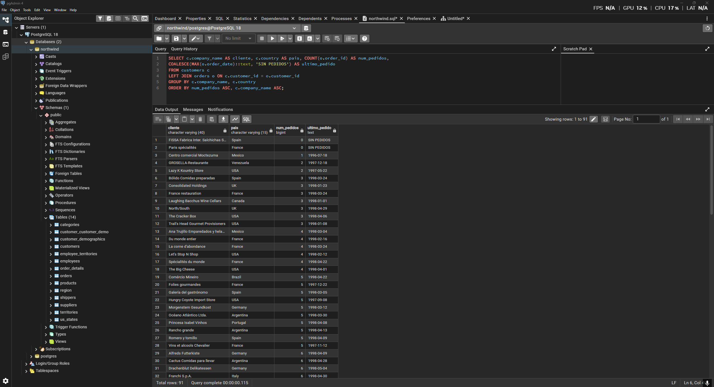
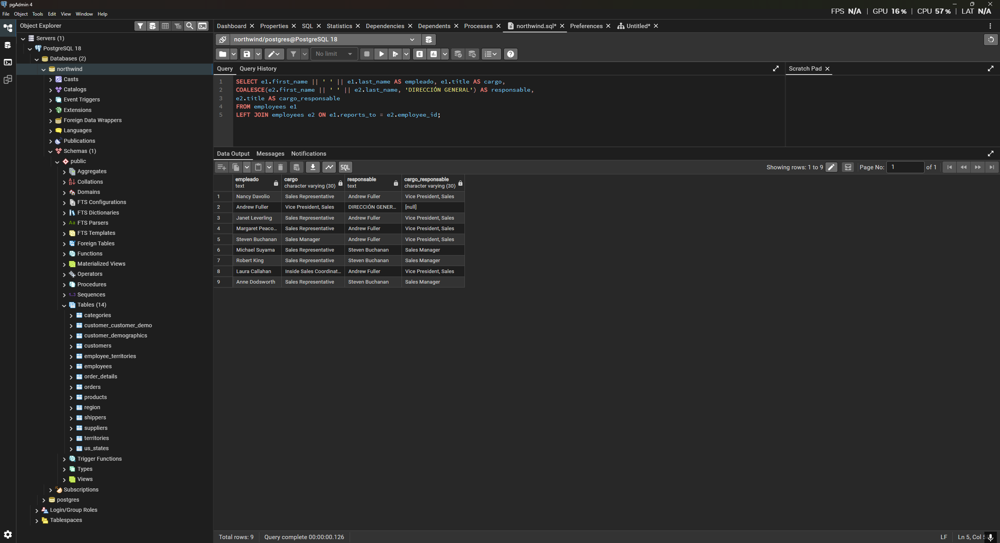
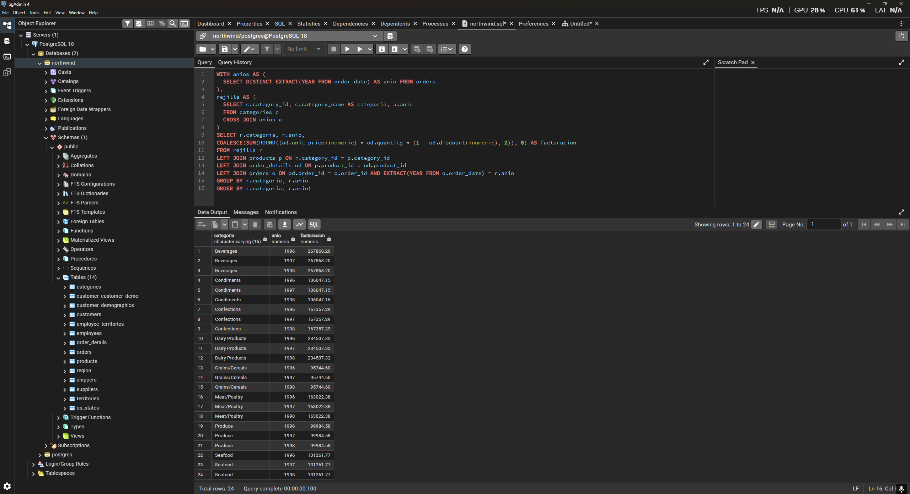
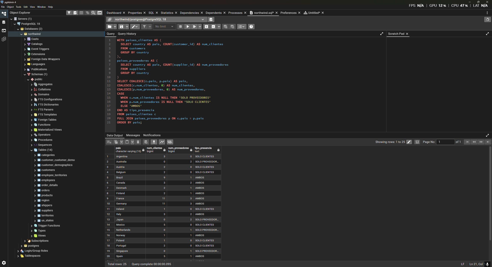
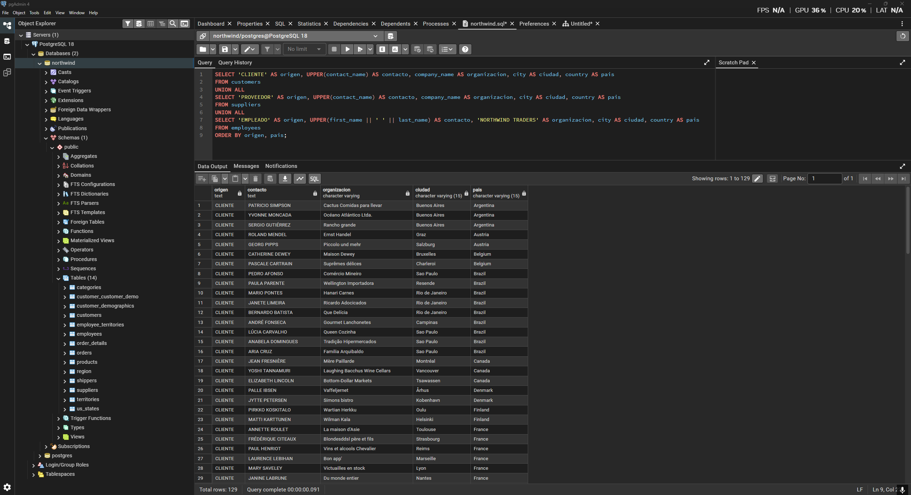

# Respuestas a los ejercicios prácticos

## Pregunta 1 — Catálogo comercial activo
**Enunciado:** Obtén los productos que no están descatalogados y cuyo precio unitario esté entre 10 y 50 euros, ambos incluidos. Muestra el nombre del producto y su precio redondeado a dos decimales, ordenado de mayor a menor precio.

**Consulta:**
```sql
SELECT product_name AS producto, ROUND(unit_price::numeric, 2) AS precio
FROM products
WHERE discontinued = 0 AND unit_price BETWEEN 10 AND 50
ORDER BY unit_price DESC;
```

**Resultado:**


**Comentario:** He filtrado usando `discontinued = 0` y `BETWEEN` para el rango de precios. El casteo a `numeric` dentro del `ROUND` asegura precisión decimal.

---

## Pregunta 2 — Concentración geográfica de la cartera
**Enunciado:** Cuenta cuántos clientes hay en cada país y muestra únicamente aquellos países con 5 o más clientes, ordenados de mayor a menor. Indica también cuántas ciudades distintas hay en cada uno de esos países.

**Consulta:**
```sql
SELECT country AS pais, COUNT(customer_id) AS num_clientes, COUNT(DISTINCT city) AS num_ciudades
FROM customers
GROUP BY country
HAVING COUNT(customer_id) >= 5
ORDER BY num_clientes DESC;
```

**Resultado:**


**Comentario:** Uso `HAVING` porque el filtro de >= 5 clientes se aplica al resultado de la agregación `COUNT(customer_id)`, por lo que no es posible hacerlo en el `WHERE`.

---

## Pregunta 3 — Alerta de reposición
**Enunciado:** Localiza los productos activos cuyas unidades en stock sean inferiores o iguales a su nivel de reposición. Muestra el nombre, las unidades en stock, el nivel de reposición, las unidades ya pedidas al proveedor y una columna de texto que indique 'CRÍTICO' cuando el stock sea 0 y 'AVISO' en el resto de casos.

**Consulta:**
```sql
SELECT product_name AS producto, units_in_stock AS stock, reorder_level AS nivel_reposicion, units_on_order AS pedido_a_proveedor,
  CASE 
    WHEN units_in_stock = 0 THEN 'CRÍTICO'
    ELSE 'AVISO'
  END AS situacion
FROM products
WHERE discontinued = 0 AND units_in_stock <= reorder_level;
```

**Resultado:**


**Comentario:** Para crear la columna personalizada uso la sentencia condicional `CASE WHEN`. El filtro de stock menor o igual al nivel de reposición se hace fácilmente en el `WHERE`.

---

## Pregunta 4 — Ficha completa de producto
**Enunciado:** Para los productos suministrados por empresas de Italia, Francia o España, muestra el nombre del producto, el nombre de la categoría, el nombre del proveedor, su país y su ciudad. Ordena por país y, dentro de cada país, por nombre de producto.

**Consulta:**
```sql
SELECT p.product_name AS producto, c.category_name AS categoria, s.company_name AS proveedor, s.country AS pais, s.city AS ciudad
FROM products p
INNER JOIN categories c ON p.category_id = c.category_id
INNER JOIN suppliers s ON p.supplier_id = s.supplier_id
WHERE s.country IN ('Italy', 'France', 'Spain')
ORDER BY s.country, p.product_name;
```

**Resultado:**


**Comentario:** Hago `INNER JOIN` de las tablas `products`, `categories` y `suppliers` para obtener la información solicitada. Uso `IN` para filtrar por los 3 países deseados.

---

## Pregunta 5 — Detalle valorizado de un pedido
**Enunciado:** Muestra, para ese pedido (10248), el nombre del producto, el precio unitario aplicado, la cantidad, el descuento y el importe final de cada línea. Añade el nombre del cliente y la fecha del pedido.

**Consulta:**
```sql
SELECT c.company_name AS cliente, o.order_date AS fecha_pedido, p.product_name AS producto, od.unit_price AS precio_unitario, od.quantity AS cantidad, od.discount AS descuento,
ROUND((od.unit_price::numeric) * od.quantity * (1 - od.discount::numeric), 2) AS importe_linea
FROM orders o
INNER JOIN customers c USING (customer_id)
INNER JOIN order_details od USING (order_id)
INNER JOIN products p USING (product_id)
WHERE o.order_id = 10248;
```

**Resultado:**


**Comentario:** Utilizo la cláusula `USING` porque las columnas a unir comparten exactamente el mismo nombre (`customer_id`, `order_id`, `product_id`), lo que simplifica la sintaxis de las cuatro uniones.

---

## Pregunta 6 — Ranking de categorías por facturación
**Enunciado:** Calcula la facturación total de cada categoría durante toda la historia de la compañía. Muestra el nombre de la categoría, el número de líneas de pedido que ha generado, el número de productos distintos vendidos y la facturación total. Incluye únicamente las categorías que superen los 100.000 euros de facturación, ordenadas de mayor a menor.

**Consulta:**
```sql
SELECT c.category_name AS categoria, COUNT(od.order_id) AS num_lineas, COUNT(DISTINCT od.product_id) AS num_productos,
SUM(ROUND((od.unit_price::numeric) * od.quantity * (1 - od.discount::numeric), 2)) AS facturacion
FROM categories c
INNER JOIN products p ON c.category_id = p.category_id
INNER JOIN order_details od ON p.product_id = od.product_id
GROUP BY c.category_name
HAVING SUM(ROUND((od.unit_price::numeric) * od.quantity * (1 - od.discount::numeric), 2)) > 100000
ORDER BY facturacion DESC;
```

**Resultado:**


**Comentario:** Hago la agregación con `GROUP BY` por categoría, usando `COUNT(DISTINCT ...)` para los productos únicos vendidos. El filtro de más de 100.000 euros debe ir en el `HAVING` al depender de la sumatoria agregada.

---

## Pregunta 7 — Clientes sin actividad comercial
**Enunciado:** Lista todos los clientes con el número de pedidos que ha realizado cada uno y la fecha de su último pedido. Los clientes sin ningún pedido deben aparecer igualmente, con un 0 en el conteo y el texto 'SIN PEDIDOS' en lugar de la fecha. Ordena de forma que los clientes inactivos aparezcan primero.

**Consulta:**
```sql
SELECT c.company_name AS cliente, c.country AS pais, COUNT(o.order_id) AS num_pedidos,
COALESCE(MAX(o.order_date)::text, 'SIN PEDIDOS') AS ultimo_pedido
FROM customers c
LEFT JOIN orders o ON c.customer_id = o.customer_id
GROUP BY c.company_name, c.country
ORDER BY num_pedidos ASC, c.company_name ASC;
```

**Resultado:**


**Comentario:** He usado `LEFT JOIN` y `COUNT(o.order_id)` en lugar de `COUNT(*)` para que los clientes sin pedidos sumen 0. Uso `COALESCE` para manejar el valor nulo de la fecha máxima y lo convierto a texto explícitamente (`::text`).

---

## Pregunta 8 — Organigrama de la fuerza de ventas
**Enunciado:** Muestra cada empleado con su nombre completo, su cargo, el nombre completo de la persona a la que reporta y el cargo de esa persona. El empleado que no reporta a nadie debe aparecer también, con el texto 'DIRECCIÓN GENERAL' en el campo del responsable.

**Consulta:**
```sql
SELECT e1.first_name || ' ' || e1.last_name AS empleado, e1.title AS cargo,
COALESCE(e2.first_name || ' ' || e2.last_name, 'DIRECCIÓN GENERAL') AS responsable,
e2.title AS cargo_responsable
FROM employees e1
LEFT JOIN employees e2 ON e1.reports_to = e2.employee_id;
```

**Resultado:**


**Comentario:** Hago un `SELF JOIN` usando `LEFT JOIN` para incluir al director general. Es crucial el uso de alias de tabla (`e1`, `e2`) para diferenciar el empleado de su responsable.

---

## Pregunta 9 — Rejilla de cobertura categoría × año
**Enunciado:** Genera todas las combinaciones posibles de las 8 categorías con los 3 años del histórico (24 filas) y asocia a cada combinación su facturación. Ordena por categoría y año.

**Consulta:**
```sql
WITH anios AS (
  SELECT DISTINCT EXTRACT(YEAR FROM order_date) AS anio FROM orders
),
rejilla AS (
  SELECT c.category_id, c.category_name AS categoria, a.anio
  FROM categories c
  CROSS JOIN anios a
)
SELECT r.categoria, r.anio,
COALESCE(SUM(ROUND((od.unit_price::numeric) * od.quantity * (1 - od.discount::numeric), 2)), 0) AS facturacion
FROM rejilla r
LEFT JOIN products p ON r.category_id = p.category_id
LEFT JOIN order_details od ON p.product_id = od.product_id
LEFT JOIN orders o ON od.order_id = o.order_id AND EXTRACT(YEAR FROM o.order_date) = r.anio
GROUP BY r.categoria, r.anio
ORDER BY r.categoria, r.anio;
```

**Resultado:**


**Comentario:** Utilizo un `CROSS JOIN` en una CTE para construir el esqueleto de 24 combinaciones (categoría × año) y posteriormente lo uno (`LEFT JOIN`) con los datos reales, asegurando que las combinaciones sin ventas queden con facturación 0.

---

## Pregunta 10 — Mapa de países: clientes frente a proveedores
**Enunciado:** Una única tabla que muestre, para cada país en el que la compañía tiene presencia, cuántos clientes y cuántos proveedores hay. Deben aparecer los países que solo tienen clientes, los que solo tienen proveedores y los que tienen ambos.

**Consulta:**
```sql
WITH paises_clientes AS (
  SELECT country AS pais, COUNT(customer_id) AS num_clientes
  FROM customers
  GROUP BY country
),
paises_proveedores AS (
  SELECT country AS pais, COUNT(supplier_id) AS num_proveedores
  FROM suppliers
  GROUP BY country
)
SELECT COALESCE(c.pais, p.pais) AS pais,
COALESCE(c.num_clientes, 0) AS num_clientes,
COALESCE(p.num_proveedores, 0) AS num_proveedores,
CASE
  WHEN c.num_clientes IS NULL THEN 'SOLO PROVEEDORES'
  WHEN p.num_proveedores IS NULL THEN 'SOLO CLIENTES'
  ELSE 'AMBOS'
END AS tipo_presencia
FROM paises_clientes c
FULL JOIN paises_proveedores p ON c.pais = p.pais
ORDER BY pais;
```

**Resultado:**


**Comentario:** Calculo de forma aislada las cantidades por país en CTEs independientes y uso un `FULL JOIN` para unirlas. Así retengo países que sólo están en clientes o sólo en proveedores, decidiendo el texto con un `CASE WHEN`.

---

## Pregunta 11 — Directorio unificado de contactos
**Enunciado:** Construye una sola tabla que reúna los contactos de clientes, los de proveedores y los empleados. Cada fila debe indicar el origen ('CLIENTE', 'PROVEEDOR', 'EMPLEADO'), el nombre de la persona de contacto en mayúsculas, la organización a la que pertenece, la ciudad y el país. Para los empleados, la organización es el literal 'NORTHWIND TRADERS' y el nombre de contacto se forma concatenando nombre y apellidos.

**Consulta:**
```sql
SELECT 'CLIENTE' AS origen, UPPER(contact_name) AS contacto, company_name AS organizacion, city AS ciudad, country AS pais
FROM customers
UNION ALL
SELECT 'PROVEEDOR' AS origen, UPPER(contact_name) AS contacto, company_name AS organizacion, city AS ciudad, country AS pais
FROM suppliers
UNION ALL
SELECT 'EMPLEADO' AS origen, UPPER(first_name || ' ' || last_name) AS contacto, 'NORTHWIND TRADERS' AS organizacion, city AS ciudad, country AS pais
FROM employees
ORDER BY origen, pais;
```

**Resultado:**


**Comentario:** Uso `UNION ALL` para combinar tres consultas independientes en una sola tabla, asegurando coincidencia en número y orden de columnas. Utilizo la función `UPPER()` y un literal 'NORTHWIND TRADERS' para cumplir los requisitos de texto de los empleados.

